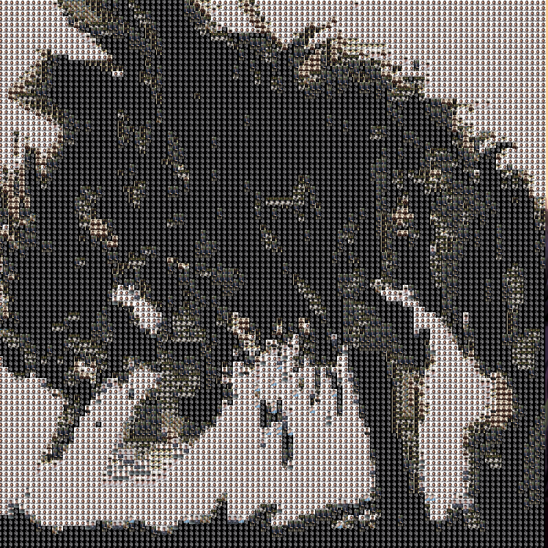

<!-- dynamic typing effect 动态打字效果 -->
### Hi there,I'm Pony👏

    

&nbsp;

<a href="https://github.com/Epic-Deno">
    

        
    

</a>
<!-- <a href="https://github.com/Epic-Deno">
    

        
    

</a> -->
<a href="https://segmentfault.com/u/_5_5fcdbf97d48d4"><embed src="https://w.segmentfault.com/card/1030000038398882.svg?theme=light&bg=f8f9fa" width="240" height="72" alt="Pony_zhang 的 SegmentFault 技术档案" title="Pony_zhang 的 SegmentFault 技术档案" /></a>

<!-- ======================================================================== -->
<!-- 
Now I'm  a web frontend developer. -->
##### I'm proud of to be a web frontend developer, and I love any kind of frontend technology, i am now my wife's husband and father of the child.

<!--  -->

-   🦄️  Read more about my [Blog](https://epic-deno.github.io/deno.github.io/)
-   📱  Follow me on [掘金](https://juejin.cn/user/1151943917713623) , [CSDN](https://blog.csdn.net/qq_44094909?spm=1010.2135.3001.5343&type=lately) , [Twitter](https://twitter.com/Ponyzz2) or [weibo](https://weibo.com/ZZandBB?is_all=1#_loginLayer_1629041370172)

**languages and Tools**
<code></code>
<code></code>
<code></code>
<code></code>
<code></code>
<code></code>
<code></code>
<code></code>
<code></code>
<code></code>
<code></code>
<code></code>
<code></code>
<code></code>
<code></code>

<!--  -->
 

 
    
    

 

🌟 GitHub Stats

 

